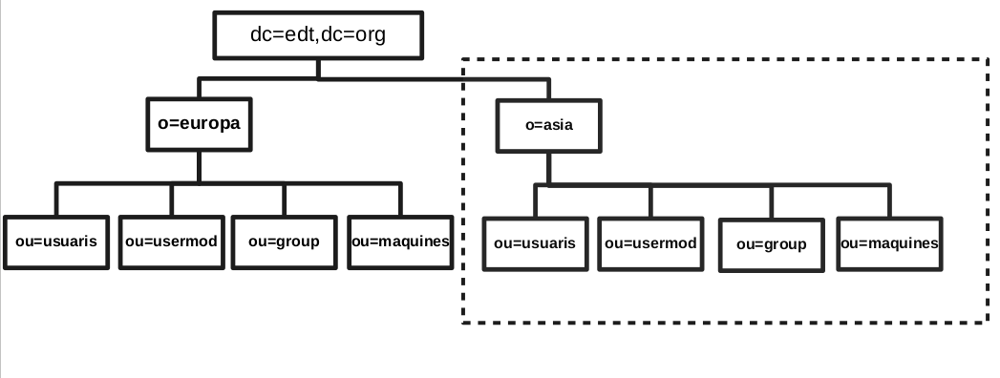

% PROJECT SERVICE LDAP
% PARVEEN
% 2019/06/05

# PROJECT INFO

My project is make one empresa in europa but also have user in asia.

Empresa with different user and and user access control.

Here i used different docker to make different ldap server and database of ldap.

Also we are going to use as clients interface and how is work connection etc.

we start from basic information and knowledge about opeldap


# BASIC INFORMATION

* LDAP
* LDAP WORK
* SLAPD.CONF
* LDIF
* SCHEMA

# LDAP

LDAP stands for Lightweight Directory Access Protocol


# Where we use ldap

* Machine Authentication
* User Authentication
* User/System Groups
* Address book
* Organization Representation
* Telephony Information Store
* E-mail address look ups
* Application Configuration store


# LDAP WORK

LDAP utilizes a client-server model. 

One or more LDAP servers contain the data making up the directory information tree (DIT)


# SLAPD CONF

This directory can contain pretty much anything you want to put in it. 

You can connect it to the global LDAP directory service, or run a service all by yourself.


# LDIF

The LDAP Data Interchange Format (LDIF) is a standard plain text data interchange format for representing LDAP (Lightweight Directory Access Protocol) directory content and update requests.


# STRUCTURE OF MY LDIF

**Here i show how is my structure of ldif file all data hbd beacuse of more function we can use**

* start with Distinguished Name(suffix) **dc=edt,dc=org**

* make organization in this data **o=europa,dc=edt,dc=org**

* now make organization unit in my case **ou=usuaris,o=europa,dc=edt,dc=org**

* add new organization unit in my case **ou=group,o=europa,dc=edt,dc=org**

* add new organization unit in my case **ou=usermod,o=europa,dc=edt,dc=org**

* add new organization unit in my case **ou=maquines,o=europa,dc=edt,dc=org**

* now make new organization for another subordinate in my case **o=asia,dc=edt,dc=org**


# sub tree server

**after this all data will be make another place or docker**

* now make organization unit in my case **ou=usuaris,o=asia,dc=edt,dc=org**

* add new organization unit in my case **ou=group,o=asia,dc=edt,dc=org**

* add new organization unit in my case **ou=usermod,o=asia,dc=edt,dc=org**


* add new organization unit in my case **ou=maquines,o=asia,dc=edt,dc=org**


# FIGURE 




# Schema Specification

**To save data in a readable format in ldap we called schema(this is reason so we can )**

different schema make esay to read and write also make fuctionable data in
 ldif very important to know different type of like photo,dn,cn,binary file etc.

here one simple exemple make by mi

```
# schema add photo and pdf:
#          foto, pdf
# parveen
# Objecte  Auxiliary  (derivat de TOP)
#
attributetype (1.1.2.1.1 NAME 'xfoto'
  DESC 'foto del user jpeg'
  SYNTAX 1.3.6.1.4.1.1466.115.121.1.28)

attributetype (1.1.2.1.2 NAME 'xpdf'
  DESC 'pdf file'
  SYNTAX  1.3.6.1.4.1.1466.115.121.1.5
  SINGLE-VALUE)

objectclass (1.1.2.2.1 NAME 'xuser'
  DESC 'user add foto and pdf'
  SUP TOP
  AUXILIARY
  MUST ( xfoto $ xpdf )
 )

```

**docker ldap_schema add photo and pdf**


# Scripts

**here i make some useful scripts /etc/passwd to ldif file**


**my scripts**

```
#! /bin/bash
# description add authomatic all user
rm -rf group.ldif
rm -rf user.ldif
python group_make_ldif.py groupfile.txt group.ldif
python user_make_ldif.py user_file.txt user.ldif
```


# Replication

**ldap server backup save called replication**

OpenLDAP now supports a wide variety of replication topologies, these terms have been deprecated in favor of provider and consumer: A provider replicates directory updates to consumers; consumers receive replication updates from providers. Unlike the rigidly defined master/slave relationships, provider/consumer roles are quite fluid: replication updates received in a consumer can be further propagated by that consumer to other servers, so a consumer can also act simultaneously as a provider. Also, a consumer need not be an actual LDAP server; it may be just an LDAP client.

but today ldap user ldap provider and consumer server which can we use both as main server and for backup.


# This is my modifyldif

```
dn: cn=Pere Pou,ou=usuaris,dc=edt,dc=org
changetype: modify
add: description
description: add by provider
```

**But you can change anythings in master or consumer**


# provider

* overlay syncprov
* syncprov-checkpoint 50 10
* syncprov-sessionlog 100


# consumer

**addtion conf. in consumer**

```
syncrepl rid=001
  provider=ldap://ldap_p
  type=refreshOnly
  interval=00:00:00:10
  searchbase="dc=edt,dc=org"
  binddn="cn=Manager,dc=edt,dc=org"
  credentials=jupiter
updateref ldap://ldap_p
```


# Subordinate and TLS

**Subordinate knowledge information may be provided to delegate a subtree. Subordinate knowledge information is maintained in the directory as a special referral object at the delegate point. The referral object acts as a delegation point, gluing two services together. This mechanism allows for hierarchical directory services to be constructed.**


**NOTE:- if one data str. conf to where we can find iformation about this DSA (another DIT) this is called referral**


**But we use this referral to server collect all information and send to client**  


# LDAP TLS basic openssl

**docker connect to ldapschema by using tls (ca certificat) or start tls means that can connect normal or if both client and server have conf for tls then start tls**

**user old cert to my new data working great only change extension**
**must be use same and no project network beacuse of ip adress or add subject alter name**


# LDAP PAM


**here docker ldap_pam  connect to ldap_schema and valid to user to login mount of home if not exists then make new one by using pam conf.**

**pam docker as host**


**check point**


# GRAHICAL VIEW PHP AND HTTPS


# PHP

**check by php ldap to look about photo and  pdf of user**


# Ldap httpd


# THANKYOU ALL OF YOU


 
